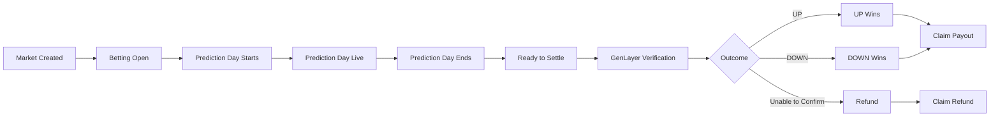
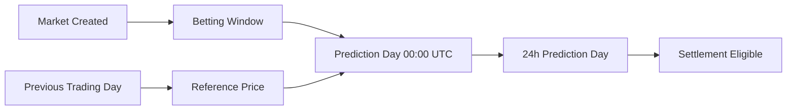
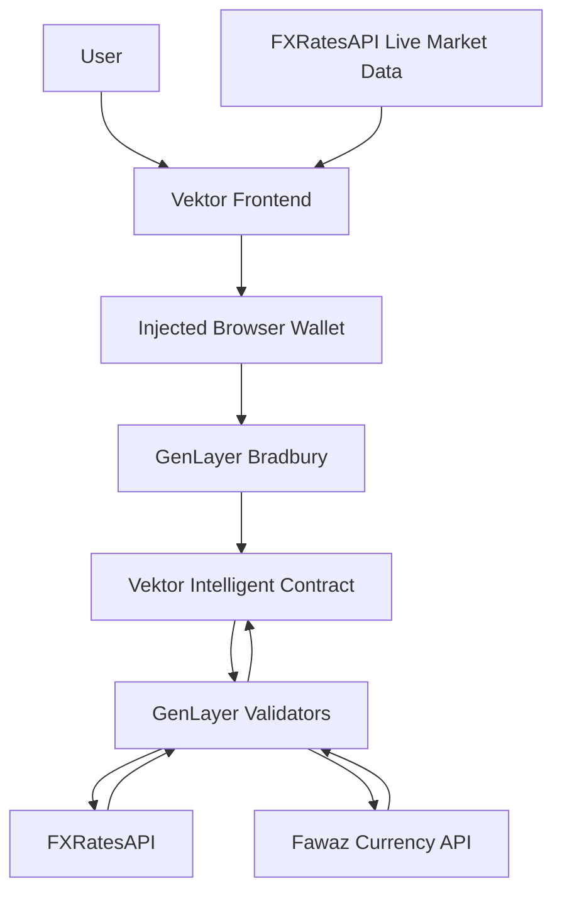
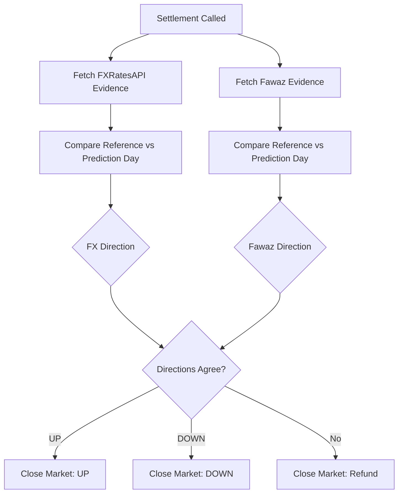

# Vektor

## Daily FX & metals prediction markets, settled by GenLayer

Vektor turns daily financial-market movement into a simple question: will a
supported instrument finish **UP** or **DOWN** compared with the previous
trading day? Users stake native GEN into a shared pari-mutuel pool, while the
Vektor Intelligent Contract uses GenLayer validators to verify the real-world
result from two independent price sources.

Anyone can create a market, anyone can settle an eligible market, and no
frontend or settlement caller can choose the evidence or outcome.

| Resource | Details |
| --- | --- |
| Network | GenLayer Bradbury Testnet |
| Contract | `0x10a27a4e2B62AE20410365e7a861106E551ADd33` |
| Repository | [github.com/jason4185/vektor](https://github.com/jason4185/vektor) |
| RPC | `https://rpc-bradbury.genlayer.com` |

## Vision

Traditional prediction markets often focus on politics, news, or one-off
events. Vektor applies the same approachable UP/DOWN interaction to liquid
financial markets without asking users to understand strikes, derivatives, or
complex order books.

Each market is a daily directional question such as:

```text
XAU/USD: UP or DOWN on Aug 11?
```

Users choose a side, stake GEN, and share the pool if their side wins. The
result does not depend on a project-controlled operator or a single manually
submitted price. GenLayer validators independently verify evidence from the
contract's configured sources and apply the result according to fixed rules.

## Key Innovations

### Daily financial markets

Vektor focuses on four curated instruments:

| Market | Category |
| --- | --- |
| GBP/USD | FX |
| USD/JPY | FX |
| XAU/USD | Metals |
| XAG/USD | Metals |

Every market asks one clear daily directional question.

### Previous-trading-day reference

The contract derives the comparison day automatically. A Monday Prediction
Day compares against Friday under the contract's previous-weekday rule. Users
do not supply the settlement reference price or evidence.

### Two-source Intelligent Settlement

FXRatesAPI and Fawaz Currency API independently compare the previous-trading-day
price with the Prediction Day price. The directions must agree. If the sources
disagree, return unusable evidence, or produce a flat/tied comparison, the
market resolves to a refund state rather than forcing a directional result.

### Permissionless creation and settlement

Market creation and settlement are public contract actions. A settler submits
only a market ID; the caller cannot choose prices, evidence, or the outcome.

### Pari-mutuel GEN pools

Users stake on one side, may add to that same side, and winners share the full
pool in proportion to their winning stake. A market with no winning-side stake
is safely treated as a refund by the contract.

### A real market experience

The frontend displays real provider prices, fixed five-minute candles, market
creation-to-present history, previous-trading-day reference lines, Prediction
Day markers, lifecycle countdowns, and contract-derived positions. Display
market data is intentionally separate from authoritative settlement.

## How a Vektor Market Works

1. Anyone selects an instrument and a weekday Prediction Day.
2. The contract derives the previous trading day and market timestamps.
3. Betting remains open until Prediction Day begins at `00:00 UTC`.
4. Users stake native GEN on UP or DOWN.
5. Prediction Day runs for 24 hours.
6. After the day ends, anyone may call `settle_market`.
7. GenLayer validators verify the two configured settlement sources.
8. The market closes UP, DOWN, or Refund.
9. Winners or refund-eligible users call `claim_payout`.



## Market Time Model



The frontend's live countdown is calculated from these contract-backed
timestamps. It does not create additional RPC traffic every second.

## Product Tour

The four image slots below are prepared for manual screenshots from the current
frontend. No screenshots are generated or fabricated in this repository. The
real images will be added in a follow-up update.

### Markets

Screenshot path: `docs/images/markets.png` *(to be added in a follow-up update)*

Discover live markets, pool positioning, real prices, lifecycle status, and the
time remaining before Prediction Day.

### Market Detail

Screenshot path: `docs/images/market-detail.png` *(to be added in a follow-up update)*

Follow real five-minute movement from market creation through Prediction Day,
with the live display kept separate from the final contract result.

### Create Market

Screenshot path: `docs/images/create-market.png` *(to be added in a follow-up update)*

Choose an instrument and Prediction Day. Vektor derives the comparison day and
timing automatically.

### Activity / Portfolio

Screenshot path: `docs/images/activity.png` *(to be added in a follow-up update)*

Track current positions, settlement actions, and claims directly from contract
state rather than fabricated frontend history.

## Architecture



The two FXRatesAPI paths have different roles:

- **Frontend display path:** current prices and five-minute candles for the
  market experience.
- **Contract settlement path:** validator-executed source checks that produce
  the authoritative market result.

The frontend never passes chart values into settlement.

## Intelligent Settlement

For each configured source, the settlement logic compares:

```text
previous-trading-day price
              vs
Prediction Day price
```

Each source independently derives UP or DOWN. GenLayer validators verify the
evidence and the resulting direction.



The contract applies the final rule:

```text
FXRatesAPI = UP and Fawaz = UP       -> UP
FXRatesAPI = DOWN and Fawaz = DOWN   -> DOWN
Anything else                        -> Refund / INCONCLUSIVE
```

If the agreed directional result has no stake on the winning side, the
contract converts that result to a refund-safe outcome.

## Live Market Experience

- FXRatesAPI provides the keyless frontend current-price feed.
- The frontend requests real one-minute provider samples.
- Samples are merged, deduplicated, and aggregated into fixed five-minute
  OHLC candles.
- Chart history begins at the market's real contract creation timestamp.
- Provider/session gaps remain visible; weekend candles are never fabricated.
- The previous-trading-day reference is shown as a separate horizontal line.
- The Prediction Day start marker is rendered only when it lies inside the
  visible chart viewport.
- Live movement is shown as a preview and never determines settlement.

## Market Lifecycle

| Phase | User experience |
| --- | --- |
| Betting open | Stake on UP or DOWN until Prediction Day begins. |
| Prediction day live | Betting has ended; the 24-hour observation period is in progress. |
| Ready to settle | The day has ended and anyone may settle the open market. |
| Settled | The contract has stored UP or DOWN and winners can claim. |
| Refund | The contract could not confirm a directional result, so original stakes can be claimed back. |

## Market Rules

- Prediction Days are weekdays under the contract's previous-weekday rule.
- Betting closes at Prediction Day `00:00 UTC`.
- Prediction Day lasts 24 hours.
- Settlement is available only after `target_end`.
- Each bet transaction must be at least `1 GEN`.
- A wallet may stake up to `10 GEN` cumulatively per market.
- A wallet may choose one side and add only to that same side.
- Market creation has no extra fee.
- Market creation and settlement are permissionless.
- Claims are made through the contract after settlement.
- Refund outcomes return the original stake.

## Payout Model

For a directional result, the winning payout is proportional to the user's
winning stake:

```text
user payout = total pool × user winning stake / total winning stake
```

Integer rounding can leave a small amount of dust. A refund returns the
original stake. The frontend labels previews as estimates; the contract is
authoritative.

## Trust Model

| Component | What it does | What it cannot do |
| --- | --- | --- |
| Frontend | Displays state and sends user transactions | Cannot choose outcomes or settlement evidence |
| Market creator | Selects an allowed instrument and Prediction Day | Cannot choose the result or override the contract |
| Settlement caller | Calls `settle_market(market_id)` | Cannot submit a chosen price or direction |
| FXRatesAPI / Fawaz | Provide external historical evidence | Neither source decides alone |
| GenLayer validators | Independently verify evidence and direction | Cannot change user stakes |
| Contract | Stores state and applies payout/refund rules | Does not trust frontend calculations |

## Contract Interface

The deployed production surface contains **4 writes, 15 views, and 19 total
public methods**.

### Writes

```text
create_market(instrument, target_date)
place_bet(market_id, side)
settle_market(market_id)
claim_payout(market_id)
```

### Views

```text
get_protocol_config
get_supported_markets
get_market
get_market_count
get_market_ids
get_markets
get_user_bet
get_user_market_ids
get_due_market_ids
get_remaining_bet_capacity
get_claimable_payout
get_user_market_status
can_place_bet
can_claim_payout
validate_market_creation
```

## Activity Architecture

Activity is reconstructed from current contract state using paginated user
market IDs, market records, user market status, claimable state, and due-market
IDs. It is deliberately a current-state status feed, not a pretend event log.

There is no `localStorage`, `sessionStorage`, IndexedDB history, fabricated
timestamp, synthetic event, or backend indexer behind Activity. A refresh,
reconnect, or second device reconstructs the same state from the contract.

## Tech Stack

- React and TypeScript
- TanStack Start, Router, and Query
- Vite and Tailwind CSS
- Wagmi and Viem for injected wallet/account/network state
- RainbowKit for wallet UI
- GenLayerJS for Intelligent Contract reads and writes
- FXRatesAPI for frontend live market display and configured settlement evidence
- Fawaz Currency API for the second settlement source

## Repository Structure

```text
Vektor/
├── contracts/
│   └── Vektor.py
├── frontend/
│   ├── src/
│   ├── public/
│   ├── package.json
│   └── package-lock.json
├── tests/
├── docs/
└── README.md
```

## Local Development

```bash
git clone https://github.com/jason4185/vektor.git
cd vektor/frontend
npm ci
cp .env.example .env.local
npm run dev
```

The browser frontend requires the public contract address:

```text
VITE_VEKTOR_CONTRACT_ADDRESS=0x10a27a4e2B62AE20410365e7a861106E551ADd33
```

The Bradbury RPC and chain configuration come from the checked-in GenLayer
configuration. No FXRatesAPI key is required. A browser-injected wallet on
Bradbury is required for writes; WalletConnect is not configured.

Useful checks:

```bash
npx tsc --noEmit
npm run lint
npm run build
```

## Deployment

Vercel should use the `frontend` directory as its root directory:

```text
Install command: npm ci
Build command:   npm run build
Root directory:  frontend
```

Set this public environment variable for Production, Preview, and Development:

```text
VITE_VEKTOR_CONTRACT_ADDRESS=0x10a27a4e2B62AE20410365e7a861106E551ADd33
```

No private credentials or market-data API key belong in the frontend
environment.

## Transaction UX

Writes move through a visible lifecycle:

```text
Preparing → Awaiting wallet → Submitted → Processing → Completed
```

For normal frontend UX, completion means GenLayer has reached `ACCEPTED`, the
execution result is `FINISHED_WITH_RETURN`, and accepted contract state has
reconciled. The UI does not keep users waiting for `FINALIZED`.

## Limitations and Current Scope

- Vektor currently runs on GenLayer Bradbury Testnet.
- The market universe is intentionally limited to four instruments.
- Settlement requires agreement between the two configured sources.
- Provider downtime can delay settlement; it does not create a frontend result.
- Live chart data is presentation data, not settlement evidence supplied by the user.
- Activity reconstructs current positions and statuses, not a complete historical transaction log.
- There is no centralized event indexer.

Vektor turns daily FX and metals movement into simple, permissionless markets
while GenLayer handles the hard part: independently verifying real-world
outcomes before the contract applies them.
