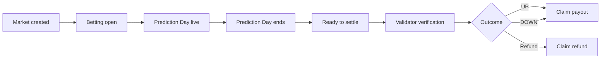
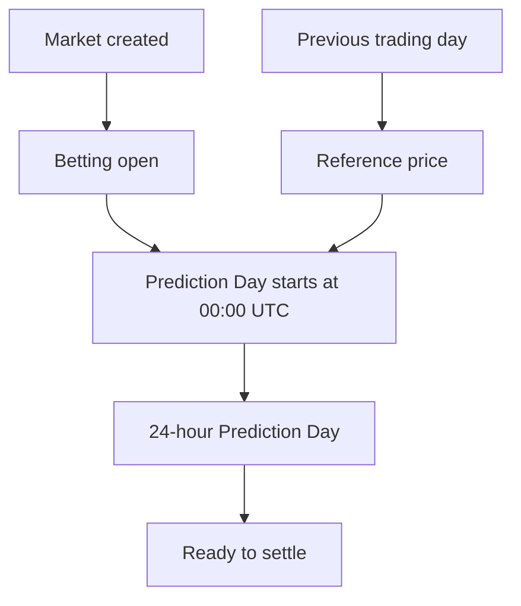
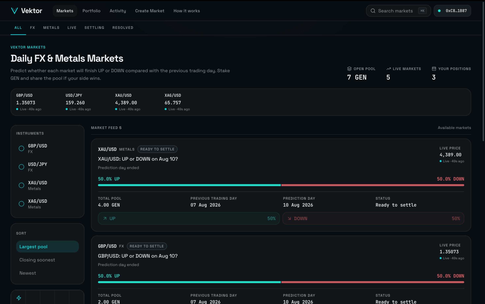
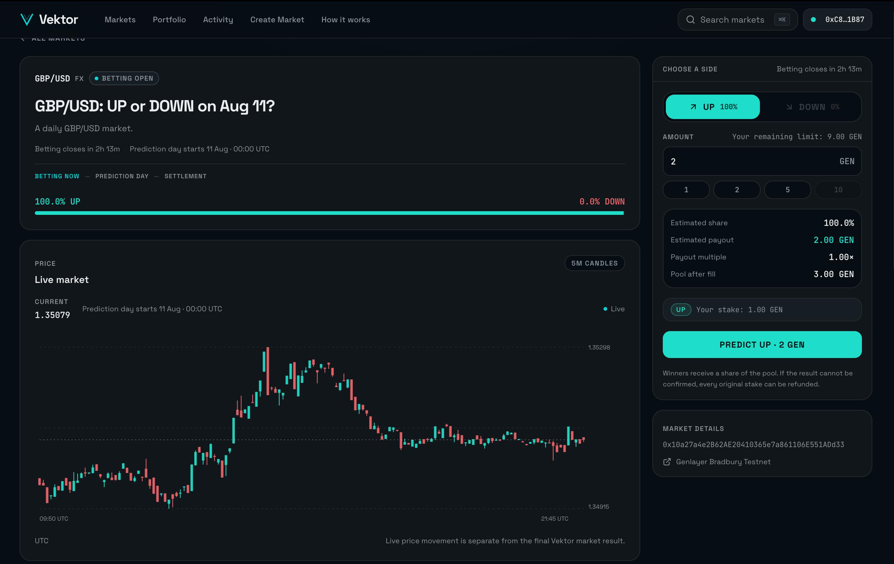
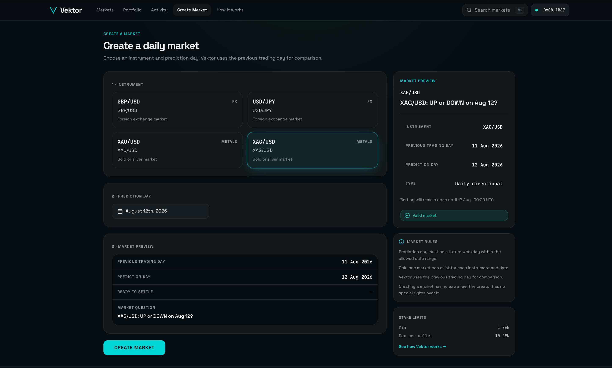
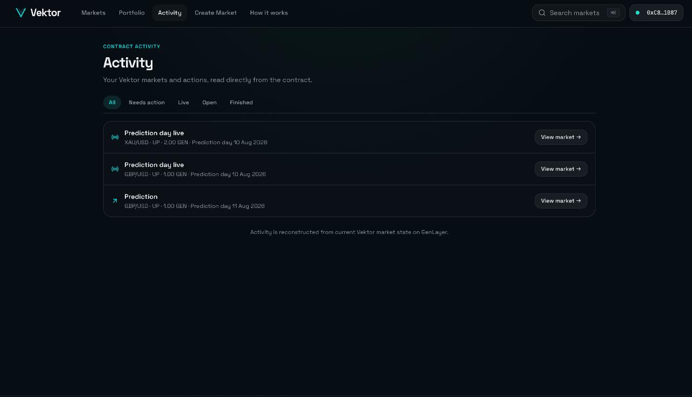
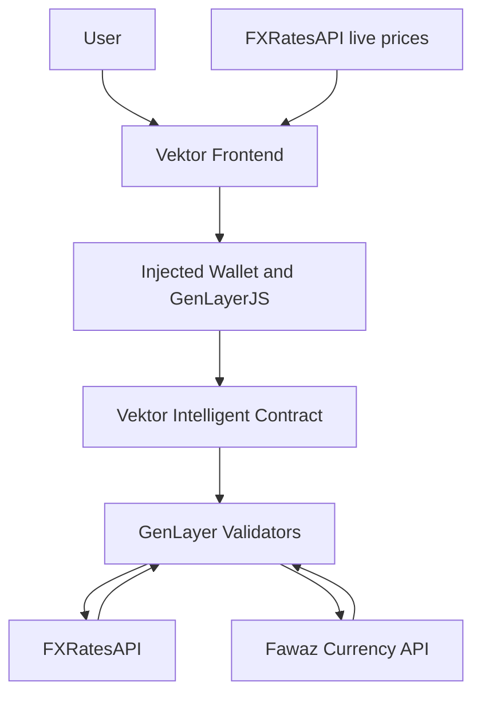

# Vektor

## Daily FX & metals prediction markets, settled by GenLayer

Vektor is a daily prediction market for FX and metals. Users choose whether a
supported instrument will finish **UP** or **DOWN** on its Prediction Day,
stake native GEN into a shared pool, and claim from the pool if their side
wins. The Vektor Intelligent Contract uses GenLayer validators and two
external price sources to verify the final result.

Anyone can create a supported market, and anyone can trigger settlement after
its Prediction Day has ended.

| Resource  | Details                                         |
| --------- | ----------------------------------------------- |
| Live Demo | [Open Vektor](https://vektor-dusky.vercel.app/) |
| Network   | GenLayer Bradbury Testnet                       |
| Contract  | `0x10a27a4e2B62AE20410365e7a861106E551ADd33`    |

## Vision

Traditional prediction markets often focus on politics, news, or one-off
events. Vektor applies the same simple binary interaction to daily financial
markets:

```text
XAU/USD: UP or DOWN on Aug 11?
```

Users do not need strike prices, order books, or complex derivatives. They
choose a direction and stake GEN.

## Why Vektor Needs GenLayer

Vektor's outcome depends on real-world prices that do not exist on-chain: the
relevant price on the previous trading day, the price on Prediction Day, and
whether independent sources agree on the direction. A conventional smart
contract cannot fetch and verify that external evidence by itself.

GenLayer lets validators independently execute the Intelligent Contract's
external-data verification logic and reach consensus on the result. The
settlement caller only starts `settle_market(market_id)`; they cannot choose
the price, evidence, direction, or outcome. This turns settlement from a
manual backend decision into contract-defined, validator-executed verification.

## Key Innovations

### Daily directional markets

Vektor supports four curated instruments and one clear daily UP/DOWN question
for each market.

### Automatic previous-trading-day reference

The contract derives the comparison date from the selected Prediction Day. For
example, a Monday Prediction Day uses Friday as its previous trading day.

### Intelligent two-source settlement

FXRatesAPI and Fawaz Currency API independently compare the previous-trading-day
price with the Prediction Day price. Their directions must agree.

### Permissionless lifecycle

Anyone can create supported markets and anyone can trigger eligible settlement.
Callers cannot choose the evidence, direction, or final outcome.

### Pari-mutuel GEN pools

Users stake on one side, may add to that same side, and winners receive a
proportional share of the total pool.

## Supported Markets

| Market  | Category |
| ------- | -------- |
| GBP/USD | FX       |
| USD/JPY | FX       |
| XAU/USD | Metals   |
| XAG/USD | Metals   |

## How a Vektor Market Works

1. Select a supported instrument and a weekday Prediction Day.
2. The contract derives the previous trading day and market timestamps.
3. Users stake GEN on UP or DOWN before Prediction Day begins.
4. Prediction Day runs for 24 hours.
5. After it ends, anyone may call `settle_market(market_id)`.
6. GenLayer validators verify the two configured price sources.
7. The market resolves UP, DOWN, or Refund.
8. Eligible users claim directly from the contract.



## Market Time Model



Markets are created with a canonical `YYYY-MM-DD` Prediction Day. The contract
accepts weekdays only, allows dates up to 366 days ahead, derives the previous
trading day, and sets `target_end` exactly 24 hours after the Prediction Day starts.
Betting closes at `target`, and settlement is eligible at `target_end` while
the market is still open.

## Intelligent Settlement

Settlement is called with only a market ID. The contract's validator-executed
logic fetches the previous-trading-day and Prediction Day values from:

- FXRatesAPI
- Fawaz Currency API, with its configured fallback source when needed

Each source independently derives a direction:

```text
Both sources say UP    -> UP
Both sources say DOWN  -> DOWN
Anything else           -> INCONCLUSIVE / Refund
```

The sources do not need to return identical numeric values; their directions
must agree. Invalid, missing, tied, or disagreeing evidence cannot produce a
directional result. Temporary provider failures can delay settlement rather
than silently closing the market.

```mermaid
flowchart TD
    A[settle_market(market_id)] --> B[GenLayer validator execution]
    B --> C[FXRatesAPI direction]
    B --> D[Fawaz direction]
    C --> E{Directions agree?}
    D --> E
    E -->|UP| F[Close market as UP]
    E -->|DOWN| G[Close market as DOWN]
    E -->|No| H[Close market as Refund]
```

If a directional result has no stake on the winning side, the contract changes
the final outcome to `INCONCLUSIVE`, making the position refundable instead of
attempting a zero-denominator payout.

## Market Rules

| Rule                    | Contract behavior                                   |
| ----------------------- | --------------------------------------------------- |
| Supported instruments   | GBP/USD, USD/JPY, XAU/USD, XAG/USD                  |
| Creation date format    | `YYYY-MM-DD`                                        |
| Prediction Days         | Weekdays only                                       |
| Future-date window      | After the current time and within 366 days          |
| Betting closes          | Prediction Day at 00:00 UTC                         |
| Prediction Day duration | 24 hours                                            |
| Minimum bet             | 1 GEN per transaction                               |
| Wallet cap              | 10 GEN cumulative per market                        |
| Side switching          | Not allowed                                         |
| Same-side top-up        | Allowed                                             |
| Duplicate market        | Rejected for the same instrument and Prediction Day |
| Creation fee            | None; `create_market` is not payable                |
| Settlement              | Anyone may call it after `target_end`               |
| Claims                  | After the market is closed                          |

## Payouts and Refunds

For a directional result, the contract calculates a proportional payout:

```text
payout = total pool × user's winning stake / total winning stake
```

A user on the losing side cannot claim. In an `INCONCLUSIVE` outcome, the
user's original stake is returned. A claim marks the position as claimed, so a
position cannot be claimed twice.

## Live Market Experience

The frontend has a separate display-data path for the market experience:

- real current prices from FXRatesAPI
- one-minute provider samples aggregated into fixed five-minute candles
- chart history beginning at the market's real creation time
- real provider gaps, with no fabricated weekend candles
- a previous-trading-day reference line
- a Prediction Day marker when that timestamp is visible
- a live UP/DOWN preview during Prediction Day

Live chart data is for presentation only. The final market result comes from
the Intelligent Contract settlement process described above.

## Product Tour

The current frontend in four views:

<table>
  <tr>
    <td width="50%">
      
    </td>
    <td width="50%">
      
    </td>
  </tr>
  <tr>
    <td width="50%">
      
    </td>
    <td width="50%">
      
    </td>
  </tr>
</table>

### Markets

Browse daily FX and metals markets, live prices, pool positioning, and lifecycle timing.

### Market Detail

Follow real five-minute price movement, the previous-trading-day reference,
market timing, and your position.

### Create Market

Choose an instrument and Prediction Day while Vektor derives the comparison
date and betting deadline.

### Activity

Track current positions, settlement actions, and claim states directly from
contract state.

## Architecture



The wallet/GenLayerJS path reads and writes contract state. The FXRatesAPI
frontend path supplies display prices and charts. Frontend chart data never
settles a market.

## Activity

Activity is reconstructed from current contract state rather than treated as
a fabricated transaction log. The frontend uses paginated user market IDs,
market records, user market status, claimable state, and due-market IDs.

No `localStorage`, `sessionStorage`, IndexedDB history, fabricated timestamps,
or synthetic events are used. A refresh or another device can reconstruct the
same current positions and statuses from the contract.

## Trust Model

- Creators cannot choose final outcomes.
- Settlement callers cannot provide a result or price.
- Settlement sources are fixed in the contract.
- GenLayer validators independently execute and verify settlement logic.
- Source disagreement follows the contract's refund rules.
- Frontend price data is not authoritative settlement evidence.

## Contract Interface

The deployed contract exposes **4 writes, 15 views, and 19 total public
methods**.

### Writes

```text
create_market
place_bet
settle_market
claim_payout
```

### Views

```text
get_protocol_config
get_supported_markets
get_market
get_market_count
get_market_ids
get_markets
get_user_bet
get_user_market_ids
get_due_market_ids
get_remaining_bet_capacity
get_claimable_payout
get_user_market_status
can_place_bet
can_claim_payout
validate_market_creation
```

## Trustworthy Transaction UX

The frontend shows writes through:

```text
Preparing → Awaiting wallet → Submitted → Processing → Completed
```

For frontend UX, completion means GenLayer has accepted successful execution
and the accepted contract state has reconciled. The interface does not make
users wait for the later `FINALIZED` state.

## Tech Stack

- React and TypeScript
- TanStack Start, Router, and Query
- Vite and Tailwind CSS
- Wagmi, Viem, and RainbowKit for injected wallet connection and wallet UI
- GenLayerJS for Intelligent Contract reads and writes
- FXRatesAPI for frontend market display and configured settlement evidence
- Fawaz Currency API for the second settlement source

## Repository Structure

```text
Vektor/
├── contracts/
│   └── Vektor.py
├── frontend/
│   ├── src/
│   ├── public/
│   ├── package.json
│   └── package-lock.json
├── tests/
├── docs/
└── README.md
```

## Local Development

```bash
git clone https://github.com/jason4185/vektor.git
cd vektor/frontend
npm ci
cp .env.example .env.local
npm run dev
```

Set the public contract address in `frontend/.env.local`:

```text
VITE_VEKTOR_CONTRACT_ADDRESS=0x10a27a4e2B62AE20410365e7a861106E551ADd33
```

The Bradbury chain and RPC are configured in the frontend. No FXRatesAPI key
is required. Writes require a browser-injected wallet connected to Bradbury.

## Deployment

For Vercel, use:

```text
Root directory:  frontend
Install command: npm ci
Build command:   npm run build
```

Set `VITE_VEKTOR_CONTRACT_ADDRESS` for Production, Preview, and Development.
It is public browser configuration; do not add private credentials.

## Limitations and Current Scope

- Vektor currently runs on GenLayer Bradbury Testnet.
- The market universe is limited to four instruments.
- Prediction Days use the contract's weekday rule rather than an exchange-holiday calendar.
- Settlement requires agreement between the two configured sources.
- Provider availability can delay settlement attempts.
- The frontend live feed is display-only.
- Activity reconstructs current state, not a complete chronological event history.
- There is no centralized event indexer.

Vektor makes daily FX and metals movement simple to predict while GenLayer
provides the independent verification needed to apply real-world results on a
contract.
